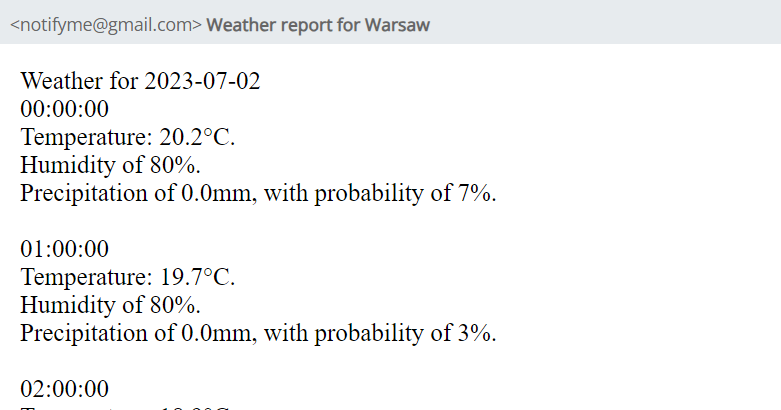

<a name="readme-top"></a>

[![MIT License][license-shield]][license-url]


<!-- PROJECT LOGO -->
<br />
<div align="center">
  <a href="https://github.com/lk36875/notifyme">
    
  </a>

<h3 align="center">NotifyMe</h3>

  <p align="center">
    REST API that provides weather notification for registered users.
    <br />
</div>


<!-- TABLE OF CONTENTS -->
<details>
  <summary>Table of Contents</summary>
  <ol>
    <li>
      <a href="#about-the-project">About The Project</a>
      <ul>
        <li><a href="#built-with">Built With</a></li>
      </ul>
    </li>
    <li>
      <a href="#getting-started">Getting Started</a>
      <ul>
        <li><a href="#prerequisites">Prerequisites</a></li>
        <li><a href="#installation">Installation</a></li>
      </ul>
    </li>
    <li><a href="#license">License</a></li>
    <li><a href="#contact">Contact</a></li>
  </ol>
</details>


<!-- ABOUT THE PROJECT -->
## About The Project




NotifyMe is a Python Flask framework project designed as an API. It offers user registration and login functionalities, allowing users to receive a JSON Web Token (JWT) for authentication. With this token, users can subscribe to weather reports.

The weather reports provided by NotifyMe are customizable. Users have the option to receive hourly reports for each day or obtain daily data for an entire week. The project uses PostgreSQL to store user information and event data, while weather data is stored in MongoDB.

To automate tasks, NotifyMe utilizes Celery, a distributed task queue system. Celery runs periodic tasks to retrieve location information for a specified city and fetches weather forecasts from the OpenMeteo API. The retrieved data is then formatted and sent to users via email.

If you require additional information about the available routes and endpoints, you can visit the /api/help route, which provides details on all accessible endpoints.

<p align="right">(<a href="#readme-top">back to top</a>)</p>


### Built with:

* [![Flask][Flask]][Flask-url]
* [![Celery][Celery]][Celery-url]
* [![MongoDB][MongoDB]][MongoDB-url]
* [![PostgreSQL][PostgreSQL]][PostgreSQL-url]
* [![SQLalchemy][SQLalchemy]][SQLalchemy-url]
* [![Docker][Docker]][Docker-url]
* [![Pytest][Pytest]][Pytest-url]
* [![Github Actions][Github Actions]][Github-Actions-url]

<p align="right">(<a href="#readme-top">back to top</a>)</p>


<!-- GETTING STARTED -->
## Getting Started

This is how you can set up this project locally.

### Prerequisites

- docker
- docker-compose
- Python


### Installation

1. Clone the repo
   ```sh
   git clone https://github.com/lk36875/notifyme.git
   ```
2. Enter *notify* directory
   ```sh
   cd notify
   ```
3. Create *.env* file following instructions from *example_env* file. 
4. Run docker-compose
   ```sh
   docker-compose up -d
   ```
5. Containers will be created, with Flask endpoints available at http://localhost:5000/.

<p align="right">(<a href="#readme-top">back to top</a>)</p>


<!-- LICENSE -->
## License

Distributed under the MIT License. See `LICENSE.txt` for more information.

<p align="right">(<a href="#readme-top">back to top</a>)</p>


<!-- CONTACT -->
## Contact

Łukasz Główka - [LinkedIn](https://www.linkedin.com/in/%C5%82ukasz-g%C5%82%C3%B3wka-712b7b1b1/)

Project Link: [https://github.com/lk36875/notifyme](https://github.com/lk36875/notifyme)

<p align="right">(<a href="#readme-top">back to top</a>)</p>


<!-- MARKDOWN LINKS & IMAGES -->
[license-url]: https://github.com/lk36875/notifyme/blob/main/LICENSE.txt


[Flask]: https://img.shields.io/badge/Flask-000000?style=for-the-badge&logo=flask&logoColor=white
[Flask-url]: https://flask.palletsprojects.com/en/2.3.x/

[Celery]: https://img.shields.io/badge/Celery-37814A?style=for-the-badge&logo=celery&logoColor=green
[Celery-url]: https://docs.celeryq.dev/en/stable/


[MongoDB]: https://img.shields.io/badge/MongoDB-4EA94B?style=for-the-badge&logo=mongodb&logoColor=white
[MongoDB-url]: https://www.mongodb.com/

[PostgreSQL]: https://img.shields.io/badge/PostgreSQL-316192?style=for-the-badge&logo=postgresql&logoColor=white
[PostgreSQL-url]: https://www.postgresql.org/

[SQLAlchemy]: https://img.shields.io/badge/SQLAlchemy-grey?style=for-the-badge
[SQLAlchemy-url]: https://www.sqlalchemy.org/

[Docker]: https://img.shields.io/badge/docker-2496ED?style=for-the-badge&logo=docker&logoColor=white
[Docker-url]: https://laravel.com

[Pytest]: https://img.shields.io/badge/pytest-0A9EDC?style=for-the-badge&logo=pytest&logoColor=black
[Pytest-url]: https://docs.pytest.org/en/7.3.x/

[Github Actions]: https://img.shields.io/badge/github_actions-2088FF?style=for-the-badge&logo=githubactions&logoColor=black
[Github-Actions-url]: https://github.com/features/actions

[license-shield]: https://img.shields.io/github/license/lk36875/notifyme.svg
[license-url]: https://github.com/lk36875/notifyme/blob/main/LICENSE.txt